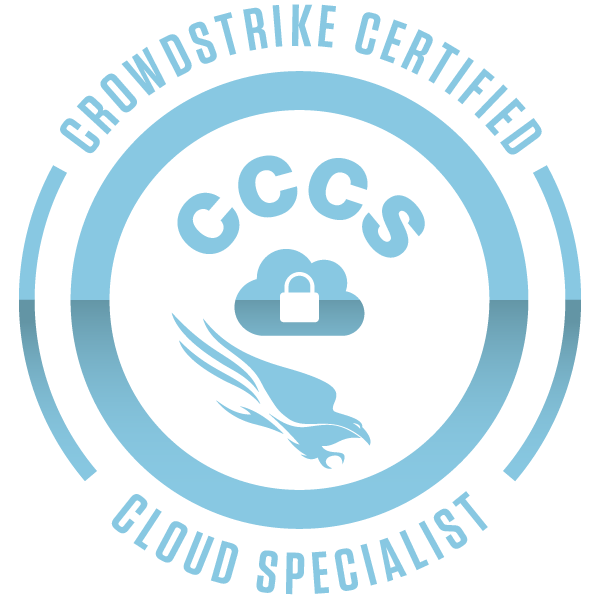

<p align="center">
  
</p>

# CCCS Practice Exam Simulator

An offline, single-file HTML practice simulator for the **CrowdStrike Certified Cloud Specialist (CCCS)** exam.

> ⚠️ **This is NOT an official CrowdStrike exam.** This is an independent study tool built from public CrowdStrike documentation and my own study notes. It is not affiliated with, endorsed by, or sponsored by CrowdStrike.

---

## My Story

I built this simulator while preparing for the CCCS certification, and I passed. Same method I used for my AWS AI Practitioner exam: study the official material, then hammer practice questions with immediate explanations until the weak spots disappear.

After passing, I went back and tuned the question bank based on what the real exam actually emphasizes: **EKS and Kubernetes scenarios, onboarding troubleshooting, drift indication response, console filters, roles and permissions, and misconfigurations (IOM)**. Those areas got extra questions on purpose.

That said, **this simulator does not replace the official CrowdStrike University courses**. The mandatory learning path (CLOUD 090 through SOAR 100) is the real preparation. This tool works best as a complementary companion: test yourself domain by domain, review explanations, and keep coming back to what you got wrong.

---

## Features

| Feature | Description |
|---|---|
| **Practice exam mode** | 25 questions sampled by domain weights, 40-minute countdown, feedback only at the end, pass at 80% |
| **Custom mode** | Choose how many questions, feedback style (immediate / end / none), and timer on/off |
| **By domain** | Filter by any of the 6 domains, with a secondary subdomain filter |
| **Learning mode** | Choose a topic, get immediate explanations after every answer |
| **Question navigator** | Numbered grid to jump between questions; answered, flagged, and skipped states at a glance |
| **Pause & resume** | Freeze the timer mid-exam and come back later |
| **Per-question review** | After any exam, review every question with your pick, the correct answer, and a full explanation |
| **History** | Last 10 exams saved locally. Click any to re-review |
| **Mark to redo** | Flag questions you want to revisit |
| **Dark mode** | Toggle light/dark theme; preference is saved |
| **Offline** | One HTML file, no server, no dependencies. Open it directly in any browser |

**Language note:** questions are in English (like the real exam); explanations are in Portuguese.

---

## Question Bank

**88 questions** across 6 domains:

| Domain | Name | Questions |
|---|---|---|
| D1 | Platform Fundamentals & Onboarding | 17 |
| D2 | Cloud Assets & Posture (CSPM) | 17 |
| D3 | Image & Container Security | 21 |
| D4 | Sensor Deployment & Runtime Protection | 15 |
| D5 | Identity & Cloud Detection (CDR) | 8 |
| D6 | SaaS, ASPM & Automation *(focus domain)* | 10 |

**D1–D5** are the core domains and feed the Practice exam and Custom modes.
**D6** is a supplemental focus domain (Falcon Shield, ASPM, Fusion SOAR), available in By domain and Learning modes.

The three heaviest domains (Kubernetes/containers, onboarding, CSPM/IOM) match what the real exam emphasizes the most.

**Question types included:**
- Single-choice (standard)
- Multiple response: Select TWO

Every question includes a full explanation, a per-option breakdown of why each alternative is right or wrong, and a short memory tip.

---

## How to Use

1. Download `cccs-simulado.html`
2. Open it in any modern browser (Chrome, Edge, Firefox, Safari)
3. No installation, no internet connection required

That's it.

---

## Exam Modes Explained

### Practice Exam (25 questions)
Mirrors the format of the official CCCS practice exam:
- 25 questions sampled by domain weights (D1 4 · D2 6 · D3 7 · D4 5 · D5 3) from the full pool, so every attempt varies
- 40-minute countdown with pause support
- Feedback only at the end
- Score in percentage, passing at 80%

The real certification exam is longer (60 questions, 90 minutes), so treat this as a focused drill, not a full dress rehearsal.

### Custom
Pick your own question count, feedback timing, and timer settings.

### By Domain
Select one of the 6 domains. Domains with multiple subdomains (e.g., D3 has "Images, registries and Kubernetes" and "Shift left: IaC and CI/CD") show a secondary filter automatically.

### Learning
Select a topic from any domain. Every question shows the correct answer and a full explanation immediately. Best for targeted study sessions.

---

## Mark to Redo

During any quiz, a **"Mark to redo"** button appears on each question. Marking it flags the question for future review. On the setup screen, a panel lists all flagged questions with options to view, remove, copy, or clear them. Marks persist across sessions via `localStorage`.

---

## How the Questions Were Made

The bank was built in three layers, each kept as a separate JSON file for traceability:

1. **Core (25 questions)**: written from my study notes with original scenarios and wording. They test the same knowledge points I studied for the exam, in the style and difficulty of the real thing.
2. **Generated from public sources (43 questions)**: created with an AI assistant that verified every fact against public CrowdStrike material: product pages, the cybersecurity-101 knowledge base, official blog posts, and CrowdStrike's own GitHub repositories (falcon-helm, falcon-operator, fcs-action).
3. **Real exam reinforcement (20 questions)**: added after passing, targeting the topics the real exam hits hardest (EKS/Kubernetes, onboarding troubleshooting, drift response, filters, roles, IOM).

Same approach I used for my AWS simulator: give the AI access to real documentation so it verifies instead of hallucinating, then review everything by hand.

---

## Other Simulators I Built

I build one of these for every certification I take, and only publish after passing:

| Simulator | Certification | Result |
|---|---|---|
| [AIF-C01 Practice Exam](https://github.com/darlantls/aif-c01-practice-exam) | AWS Certified AI Practitioner | ✅ Passed |
| **CCCS Practice Exam** (this repo) | CrowdStrike Certified Cloud Specialist | ✅ Passed |

The long-term plan is to unify all simulators into a single study platform.

---

## Project Structure

```
cccs-simulado.html          ← the entire app (HTML + CSS + JS + question bank)
cccs-badge.png              ← certification badge shown in this README
questions-core.json         ← layer 1: core questions (original wording)
questions-generated.json    ← layer 2: generated from public sources
questions-exam-focus.json   ← layer 3: real exam emphasis reinforcement
README.md                   ← this file
```

Everything runs from the single HTML file. The question bank is a plain JavaScript array (`BANK`) inside the `<script>` section, easy to edit directly.

---

## How to Add or Edit Questions

Each question in `BANK` follows one of two formats:

**Single-choice:**
```js
{d:"d1", c:"onboarding", q:"Question text here?",
 o:["Option A", "Option B", "Option C", "Option D"],
 a:0,  // index of the correct option
 e:"Explanation. Use <br> for line breaks and per-option notes."}
```

**Multiple response (Select TWO):**
```js
{d:"d4", c:"sensors", q:"Question text? (Select TWO.)",
 o:["Option A", "Option B", "Option C", "Option D"],
 a:[0, 2],  // array of correct option indexes
 e:"Explanation."}
```

**Domain keys:** `d1` through `d6`
**Concept keys:** defined in the `CONCEPTS` object near the top of the script.

Important: options are shuffled at runtime, so never reference options by letter (A/B/C/D) inside explanations. Reference the option text instead.

---

## Disclaimer

- This is an **unofficial** community-made study tool
- Questions are based on public CrowdStrike documentation and independent study notes
- CrowdStrike certification exams are updated periodically. Always verify against the latest official certification guide
- Passing this simulator does not guarantee passing the real exam

---

## Resources

- [CCCS Certification Exam Guide (official PDF)](https://www.crowdstrike.com/wp-content/uploads/2023/10/cccs-certification-exam-guide.pdf)
- [CrowdStrike University](https://www.crowdstrike.com/services/training-certification/) ← the mandatory learning path is the real preparation
- [Falcon Cloud Security](https://www.crowdstrike.com/platform/cloud-security/)
- [CrowdStrike on GitHub](https://github.com/CrowdStrike) (falcon-helm, falcon-operator, fcs-action)

---

## License

MIT License.

---

**Disclaimer.** Not affiliated with, endorsed by, or associated with CrowdStrike, Inc. CrowdStrike, CrowdStrike Falcon, and all related marks are trademarks of CrowdStrike, Inc.
